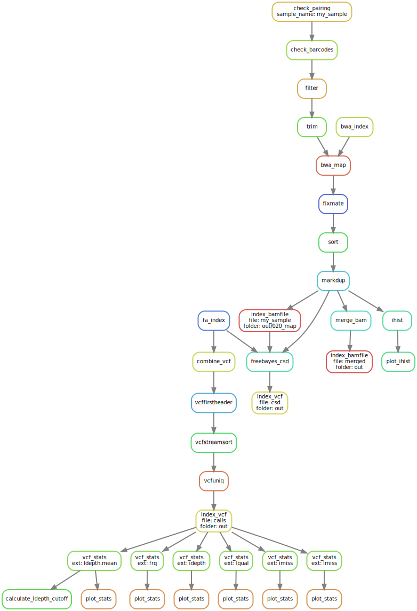

# honeybee genotype pipeline

Preconfigured pipeline for converting Illumina reads into VCF for *Apis mellifera*.

1. Check pairing
2. Strict barcode check 
3. Filter contaminants
4. Trim adaptors
5. Map against reference genome
6. Call SNPs with `freebayes` (each contig run separately in parallel)
7. Genotyping stats

In another pipeline (coming soon):

- Make a set of haplotypes from the haploid individuals (drones)
- Use whatshap to set this as a haplotype and phase the pools

## Install

[](https://singularity-hub.org/collections/3839)

Use the singularity container hosted on [Singularity hub](https://singularity-hub.org/collections/3839). The container provides:

```
bbmap 38.73
bwa 0.7.17-r1188
freebayes 1.3.1
python 3.7.5
R 3.6.1 with data.table 1.12.6 and ggplot2 3.2.1
samtools 1.9 and bcftools 1.9 using htslib 1.9
vcflib 1.0.1
vcftools 0.1.16
```

If you have the above dependencies installed, you can install the pipeline with `pip3`:

```bash
pip3 install \
    git+git://github.com/tomharrop/honeybee-genotype-pipeline.git
```

## Usage

- `threads`: Number of threads to use. Intermediate files are pipes, so at least 4 threads are required.
- `restart_times`: Number of times to restart failing jobs.
- `ref`: Reference genome (uncompressed fasta).
- `samples_csv`: a csv file with the following columns:
    - `sample`: sample name (will be propagated to output files and VCF);
    - `barcode`: sample barcode, will be checked with 0 allowed mismatches;
    - `r1_path`: path to R1 file;
    - `r2_path`: path to R2 file;
    - `metadata` (optional): currently not used.
- `outdir`: Output directory.
- `cnv_map`: Read in a whitespace-delimited file of sample names and ploidy, *e.g.* for genotyping drones and pools in a single run. See `freebayes --help` for more info.
- `ploidy`: Ploidy for freebayes, e.g. 1 for haploid, 2 for diploid.
- `csd`: Do a separate freebayes run to pick up **all** alleles at the *csd* locus (*i.e.* `--region NC_037640.1:11771679-11781139`).

```
honeybee-genotype-pipeline [-h] [-n] [--threads int]
                                  [--restart_times RESTART_TIMES] --ref REF
                                  --samples_csv SAMPLES_CSV --outdir OUTDIR
                                  [--cnv_map CNV_MAP | --ploidy PLOIDY]
                                  [--csd]

optional arguments:
  -h, --help            show this help message and exit
  -n                    Dry run
  --threads int         Number of threads. Default: 4
  --restart_times RESTART_TIMES
                        number of times to restart failing jobs (default 0)
  --ref REF             Reference genome in uncompressed fasta
  --samples_csv SAMPLES_CSV
                        Sample csv (see README)
  --outdir OUTDIR       Output directory
  --cnv_map CNV_MAP     Read a copy number map from the BED file FILE
  --ploidy PLOIDY       Ploidy for freebayes (e.g. 1 for haploid, 2 for
                        diploid)
  --csd                 Do a separate freebayes run to genotype the csd locus
```

## Graph



**n.b.** `freebayes` doesn't print in the `snakemake` rulegraph, because it comes after a [checkpoint rule](https://snakemake.readthedocs.io/en/stable/snakefiles/rules.html#data-dependent-conditional-execution). The input is from `markdup` and `generate_regions`.
